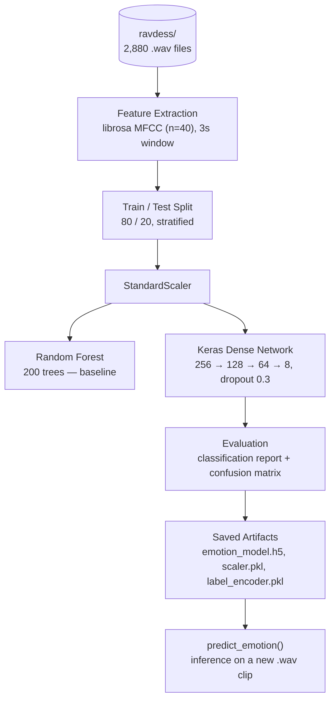
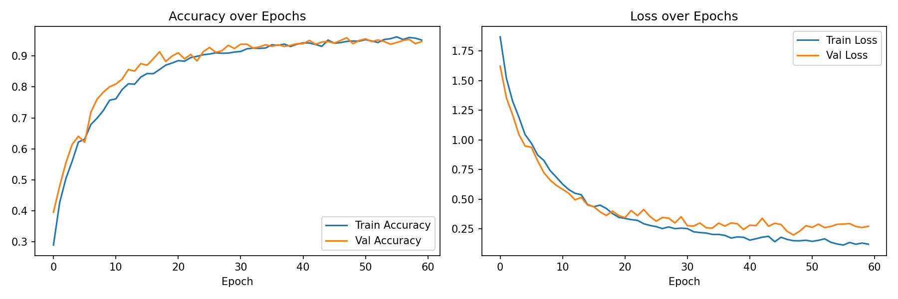
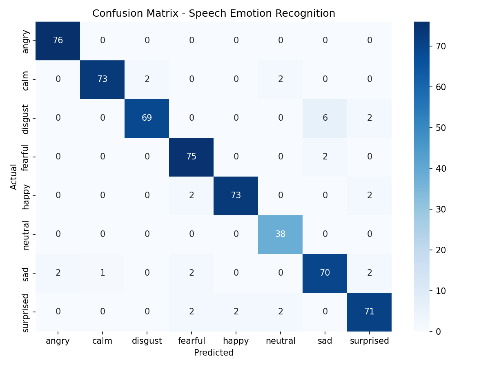

# 🎙️ Speech Emotion Recognition

### Classifying human emotion directly from raw voice audio using MFCC features and a deep neural network

[](https://www.python.org/)
[](https://www.tensorflow.org/)
[](https://scikit-learn.org/)
[](https://librosa.org/)
[](LICENSE)

---

## Problem Statement

Human speech carries emotional information in *how* something is said, not just *what* is said — pitch, tone, pace, and timbre all shift with mood. Most text-based systems miss this entirely, which is a problem for call-center analytics, mental-health check-in tools, voice assistants, and accessibility apps that need to react to a speaker's emotional state, not just their words.

**Our question:** can a model listen to a short clip of speech and correctly classify the speaker's emotion — angry, calm, happy, sad, fearful, disgusted, neutral, or surprised — using only acoustic features extracted from the waveform?

## What I Built

A full audio-classification pipeline trained on the **RAVDESS** (Ryerson Audio-Visual Database of Emotional Speech and Song) dataset, going from raw `.wav` files to a saved, deployable model:

| Stage | What it does |
|---|---|
| **Feature Extraction** | Loads each clip with `librosa`, extracts 40-dimensional MFCC features |
| **Baseline Model** | `RandomForestClassifier` (200 trees) as a quick, interpretable benchmark |
| **Deep Model** | Keras `Sequential` dense network (256→128→64→8) with dropout regularization |
| **Evaluation** | Per-class precision/recall/F1, confusion matrix, training curves |
| **Inference** | Loads a saved model + scaler + label encoder to predict emotion from a new `.wav` file |

## Dataset

- **Source:** [RAVDESS](https://zenodo.org/record/1188976) — Ryerson Audio-Visual Database of Emotional Speech and Song
- **Scale:** 2,880 labeled utterances across 8 emotion classes, split 80/20 (2,304 train / 576 test)
- **Emotion classes:** `neutral`, `calm`, `happy`, `sad`, `angry`, `fearful`, `disgust`, `surprised` — decoded from the RAVDESS filename convention (e.g. `03-01-06-...` → emotion code `06` → `fearful`)

The dataset is not owned, created, or maintained by the project author and is used solely for research and model development. For licensing and distribution terms, refer to the original data provider.

## Pipeline



## 1. Feature Extraction

Each clip is trimmed to a 3-second window (0.5s offset, to skip the initial silence RAVDESS clips tend to have), and reduced to a 40-value MFCC mean vector — a compact numerical fingerprint of the sound's timbre and pitch contour:

```python
def extract_features(file_path):
    """Load an audio file and return its mean MFCC feature vector."""
    y, sr = librosa.load(file_path, duration=3, offset=0.5)
    mfccs = librosa.feature.mfcc(y=y, sr=sr, n_mfcc=40)
    return np.mean(mfccs.T, axis=0)
```

Emotion labels are decoded straight from the RAVDESS filename convention:

```python
EMOTION_MAP = {
    '01': 'neutral', '02': 'calm', '03': 'happy', '04': 'sad',
    '05': 'angry', '06': 'fearful', '07': 'disgust', '08': 'surprised'
}
```

This produces a **2,880 × 40** feature matrix, scaled with `StandardScaler` before hitting either model.

## 2. Baseline — Random Forest

A quick, interpretable sanity check before reaching for a neural net:

```python
rf_model = RandomForestClassifier(n_estimators=200, random_state=42)
rf_model.fit(X_train, y_train)
```

**Random Forest accuracy: 92.7%** on the held-out test set — a strong baseline that confirms the MFCC features are genuinely separable by emotion.

## 3. Deep Model — Keras Dense Network

A 4-layer fully-connected network with dropout to curb overfitting on the relatively small feature set:

```python
model = keras.Sequential([
    layers.Input(shape=(X_train.shape[1],)),
    layers.Dense(256, activation='relu'),
    layers.Dropout(0.3),
    layers.Dense(128, activation='relu'),
    layers.Dropout(0.3),
    layers.Dense(64, activation='relu'),
    layers.Dense(num_classes, activation='softmax')
])
```

Trained for 60 epochs (batch size 16) with the test set held out as validation:

**Training curves — accuracy and loss over 60 epochs**


Validation accuracy climbs smoothly and tracks training accuracy closely throughout — no significant overfitting — settling around **95%** by the final epochs.

## 4. Evaluation

The trained network reaches a **final test accuracy of 95.3%**, comfortably ahead of the Random Forest baseline:

```
              precision    recall  f1-score   support

       angry       1.00      0.97      0.99        76
        calm       0.97      0.95      0.96        77
     disgust       0.97      0.90      0.93        77
     fearful       0.94      0.97      0.96        77
       happy       0.93      0.97      0.95        77
     neutral       0.95      1.00      0.97        38
         sad       0.90      0.94      0.92        77
   surprised       0.97      0.95      0.96        77

    accuracy                           0.95       576
```

**Confusion matrix — per-class prediction breakdown**


Most confusion happens between acoustically similar states — `disgust` occasionally reads as `neutral` or `surprised`, and `sad` gets mistaken for `calm` — which lines up with how these emotions actually sound in speech.

## 5. Saving & Inference

The trained model, scaler, and label encoder are persisted together so predictions are reproducible outside the notebook:

```python
model.save('models/emotion_model.h5')
pickle.dump(scaler, open('models/scaler.pkl', 'wb'))
pickle.dump(le, open('models/label_encoder.pkl', 'wb'))
```

Predicting on a new clip just re-uses the same feature-extraction + scaling pipeline:

```python
def predict_emotion(file_path, model, scaler, label_encoder):
    feat = extract_features(file_path).reshape(1, -1)
    feat_scaled = scaler.transform(feat)
    probs = model.predict(feat_scaled)[0]
    predicted_label = label_encoder.inverse_transform([np.argmax(probs)])[0]
    return predicted_label
```

## Project structure

```
speech-emotion-recognition/
├── README.md
├── LICENSE
├── requirements.txt
├── notebooks/
│   └── speech_emotion_recognition.ipynb
├── outputs/
│   ├── training_curves.png
│   ├── confusion_matrix.png
│   └── classification_report.txt
├── models/
│   ├── emotion_model.h5
│   ├── scaler.pkl
│   └── label_encoder.pkl
└── data/
    └── ravdess/                # not tracked — see Getting Started
```

## Getting Started

### Install dependencies

```bash
pip install numpy pandas librosa matplotlib seaborn scikit-learn tensorflow jupyter
```

### Get the dataset

Download RAVDESS (audio-only, speech) from [Zenodo](https://zenodo.org/record/1188976) and unzip it so the notebook's `DATA_DIR` points at the `Actor_*` folders:

```text
data/ravdess/Actor_01/, Actor_02/, ... Actor_24/
```

### Run the notebook

```bash
jupyter nbconvert --to notebook --execute notebooks/speech_emotion_recognition.ipynb
```

This regenerates everything under `outputs/` and `models/`. To predict on your own voice, record a short `.wav` clip, point `TEST_FILE` at it in the last cell, and re-run.

## Tech stack

| Layer | Tools |
|---|---|
| Audio processing | librosa |
| Feature engineering | MFCC (40 coefficients), StandardScaler |
| Baseline ML | scikit-learn (`RandomForestClassifier`) |
| Deep learning | TensorFlow / Keras (`Sequential`, `Dense`, `Dropout`) |
| Evaluation | scikit-learn (`classification_report`, `confusion_matrix`), seaborn, matplotlib |
| Model persistence | Keras `.h5`, pickle |

## License

This project is licensed under the [MIT License](LICENSE).

## Acknowledgments

- Dataset: [RAVDESS](https://zenodo.org/record/1188976) — Ryerson Audio-Visual Database of Emotional Speech and Song, Livingstone & Russo (2018)

<h2>👤 Author</h2>
<p>
  <b>Rohit Manoj Nair</b>
</p>
<p>
   
  Email: rohitmknair@gmail.com
</p>

<p>
   
  LinkedIn: https://www.linkedin.com/in/rohit-manoj/
</p>
